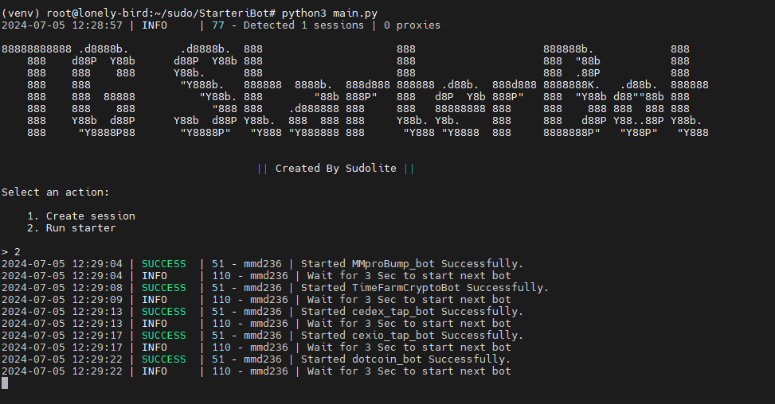

[](https://t.me/SudoLite)




## امکانات
| قابلیت‌ها                                                      | پشتیبانی |
|----------------------------------------------------------------|:---------:|
| چندنخی                                                         |     ✅     |
| اتصال یک پروکسی به یک جلسه                                     |     ✅     |
| شروع خودکار تمامی ربات‌های پشتیبانی شده با لینک ارجاع شما       |     ✅     |
| پشتیبانی از tdata / pyrogram .session / telethon .session      |     ✅     |

## لیست ربات‌ها
| نام ربات                                                       | پشتیبانی |
|----------------------------------------------------------------|:---------:|
| MMproBump_bot                                                  |     ✅     |
| pixelversexyzbot                                               |     ✅     |
| cexio_tap_bot                                                  |     ✅     |
| memefi_coin_bot                                                |     ✅     |
| dotcoin_bot                                                    |     ✅     |
| TimeFarmCryptoBot                                              |     ✅     |
| wormfare_slap_bot                                              |     ✅     |
| cedex_tap_bot                                                  |     ✅     |
| tapswap_bot                                                    |     ✅     |
| wcoin_tapbot                                                   |     ✅     |

## [تنظیمات](https://github.com/SudoLite/TGStarterBot/blob/main/.env-example)
| تنظیم                     | توضیحات                                                                     |
|---------------------------|-------------------------------------------------------------------------------|
| **API_ID / API_HASH**     | داده‌های پلتفرمی که از آن برای راه‌اندازی جلسه تلگرام استفاده می‌شود (پیش‌فرض - اندروید) |
| **START_NAME_BOT**        | آیا باید ربات را شروع کنم _(True / False)_                                  |
| **START_NAME_BOT_URL**    | آدرس MiniApp ربات تلگرام _(https://example.com/)_                              |
| **START_NAME_BOT_STR**    | متنی برای شروع ربات مانند لینک ارجاع _(r_199078201)_                           |
| **USE_PROXY_FROM_FILE**   | آیا باید از پروکسی فایل `bot/config/proxies.txt` استفاده شود (True / False) |

## نصب
می‌توانید [**مخزن**](https://github.com/SudoLite/TGStarterBot) را با کلون کردن آن در سیستم خود دانلود کرده و وابستگی‌های لازم را نصب کنید:
```shell
~ >>> git clone https://github.com/SudoLite/TGStarterBot.git
~ >>> cd TGStarterBot

# اگر از جلسات Telethon استفاده می‌کنید، سپس شاخه "converter" را کلون کنید
~ >>> git clone https://github.com/SudoLite/TGStarterBot.git -b converter
~ >>> cd TGStarterBot

#Linux
~/TGStarterBot >>> python3 -m venv venv
~/TGStarterBot >>> source venv/bin/activate
~/TGStarterBot >>> pip3 install -r requirements.txt
~/TGStarterBot >>> cp .env-example .env
~/TGStarterBot >>> nano .env # در اینجا باید API_ID و API_HASH خود را مشخص کنید، بقیه به صورت پیش‌فرض گرفته می‌شوند
~/TGStarterBot >>> python3 main.py

#Windows
~/TGStarterBot >>> python -m venv venv
~/TGStarterBot >>> venv\Scripts\activate
~/TGStarterBot >>> pip install -r requirements.txt
~/TGStarterBot >>> copy .env-example .env
~/TGStarterBot >>> # API_ID و API_HASH خود را مشخص کنید، بقیه به صورت پیش‌فرض گرفته می‌شوند
~/TGStarterBot >>> python main.py
```

همچنین، برای راه‌اندازی سریع، می‌توانید از آرگومان‌ها استفاده کنید، برای مثال:
```shell
~/TGStarterBot >>> python3 main.py --action (1/2)
# یا
~/TGStarterBot >>> python3 main.py -a (1/2)

#1 - ایجاد جلسه
#2 - اجرای Starter
```
